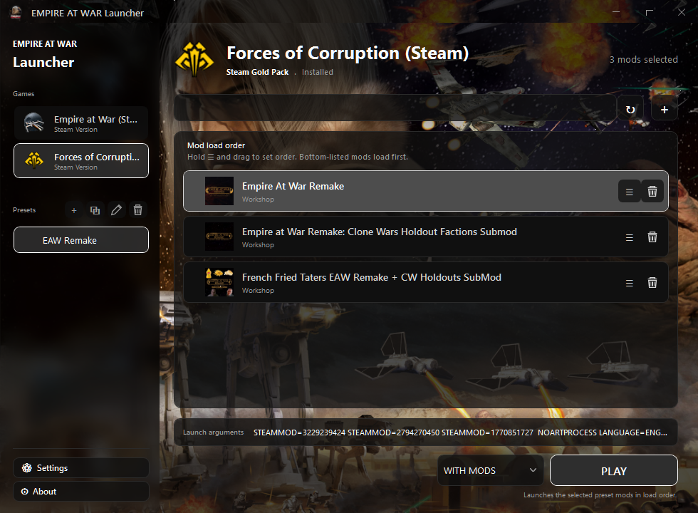
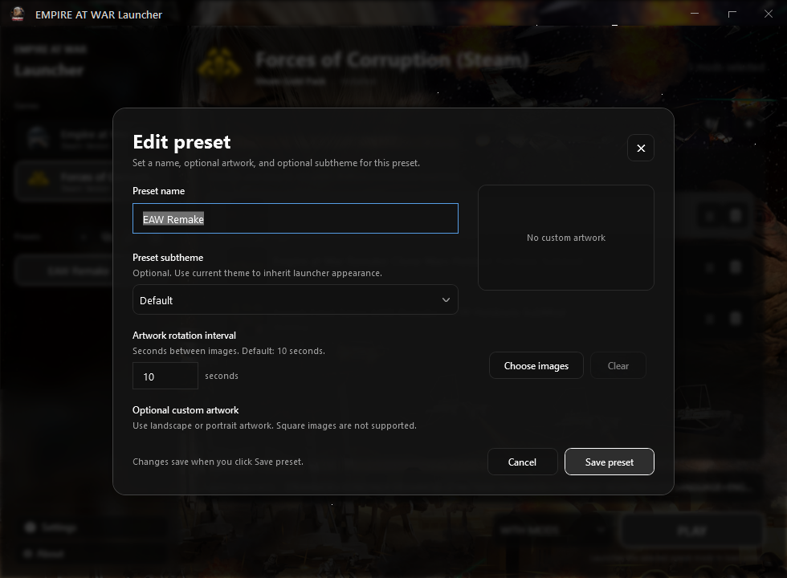
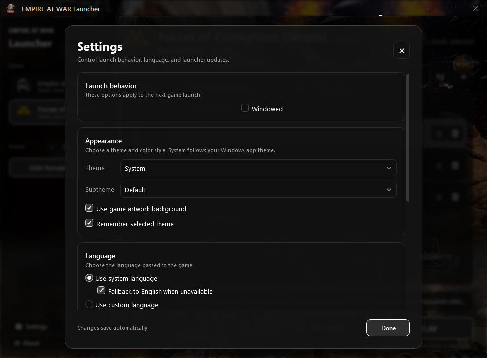

# EMPIRE AT WAR Launcher

EMPIRE AT WAR Launcher is a heavily modified launcher for **Star Wars: Empire
at War** and **Forces of Corruption**. It provides one place to choose a game,
build mod presets, manage Steam Workshop content, select artwork and themes,
configure launch behavior, and start the game with or without mods.

Project repository: <https://github.com/FuriosGuy/EAW-Launcher>

## What it does

### One launcher for both games

Choose **Empire at War** or **Forces of Corruption** from the Games list. The
launcher keeps each game's selected preset, mod order, artwork, and launch
state separate. Background artwork follows the active game automatically: EAW
uses EAW artwork, while Forces of Corruption uses FoC artwork.

### Play with mods or without mods

The play control makes launch mode explicit:

- **WITH MODS** starts the selected preset in its current load order.
- **WITHOUT MODS** starts the selected game without applying the preset's mod
  list and uses the game's default artwork.

This keeps testing the unmodified game quick, without requiring a separate
vanilla preset.

### Presets

Presets are named collections of selected mods and their order. Use sidebar
controls to create, clone, edit, or delete presets. A preset can be empty, so
users can start from a clean list and add only what they need.

Preset editing supports:

- Optional preset name.
- Optional custom artwork.
- Multiple artwork images for rotation.
- Configurable artwork rotation interval.
- Optional subtheme overriding the launcher's current appearance for that
  preset.
- Landscape or portrait artwork, while rejecting square images.

### Mod list and load order

The main panel shows selected mods, Workshop labels, thumbnails, and ordering
controls. Drag mods to reorder them; bottom-listed mods load first. Use the
trash button to remove a mod from the active preset, or use the add button to
open the mod picker.

The launcher can refresh Workshop content while it remains open. Newly added
or changed mods can appear without restarting the launcher.

### Artwork and acrylic-style UI

Artwork can come from the active game, the selected preset, or custom preset
images. Artwork transitions smoothly when switching games, presets, or launch
modes. The UI uses translucent panels, aligned artwork backdrops, blur, and
gradient overlays so controls remain readable while artwork stays visible.

Artwork backgrounds can be disabled in Settings. When disabled, the launcher
uses the selected theme's normal background and hides artwork-only gradients.

### Themes and subthemes

Choose a launcher theme and optional subtheme from Settings. Presets can also
store their own optional subtheme. Theme changes transition smoothly, and a
preset without a stored subtheme inherits the current launcher appearance.

### Settings and launch behavior

Settings control launch behavior, appearance, language, and update behavior.
Available options include:

- Windowed launch mode.
- System or custom game language.
- English fallback when a selected language is unavailable.
- Game artwork background toggle.
- Theme and subtheme selection.
- Remember selected theme.
- Updater behavior.

The launcher also remembers window width, height, and sidebar width between
sessions. Scrollable lists use edge-aware fades so content remains readable
without placing opaque color blocks over artwork.

### Launch arguments

The launch-arguments preview shows Steam mod IDs and other arguments passed to
the game. It updates with the active game, preset, and launch mode, allowing
the final command state to be checked before pressing **PLAY**.

## Typical workflow

1. Select **Empire at War** or **Forces of Corruption**.
2. Create a preset, or select an existing preset.
3. Add Workshop or installed mods.
4. Drag mods into the desired load order.
5. Choose **WITH MODS** or **WITHOUT MODS**.
6. Press **PLAY**.

## Screenshots

Repository screenshots show the current main screen, preset editor, and
Settings. The About page is intentionally excluded from this screenshot set.

## Releases and updater

The launcher checks this repository first for
`releases/LauncherUpdateData.xml` and release files under the matching
`releases/Stable`, `releases/Beta`, or `releases/Test` directory. Run
`compileRelease.bat` to build and generate the feed locally. For normal
releases, push a version tag such as `v2.0.0`; GitHub Actions builds the
Windows package, creates the GitHub Release, and publishes the updater feed to
the `master` branch automatically. `v2.0.0-beta` and `v2.0.0-test` publish to
the matching preview channel and are marked prereleases.

The GitHub Release ZIP is the initial/manual installer package. The launcher
updater uses the raw `master/releases` feed, so the feed commit must remain
available even when the GitHub Release page is not open. Existing installations
temporarily fall back to the original update feed if the new repository feed
is unavailable.

## Building

The solution is `FocLauncher.sln`. The launcher targets Windows and uses the
classic WPF/.NET Framework project structure. Build the host project or the
full solution with Visual Studio/MSBuild. `compileRelease.bat` discovers an
installed MSBuild, builds the selected configuration, and prepares release
metadata. A push or pull request targeting `master` also runs the GitHub
Actions build check in `.github/workflows/ci.yml`.

Release tags automatically become four-part assembly versions through
`tools/Set-LauncherVersion.ps1`. For a local versioned build, set
`EAW_LAUNCHER_VERSION` before running `compileRelease.bat`.

### Release checklist

1. Commit and push the changes to `master`.
2. Create and push a tag: `git tag v2.0.0; git push origin v2.0.0`.
3. Wait for the `Build and publish launcher release` workflow.
4. Confirm the ZIP is attached to the GitHub Release and the raw feed contains
   the new channel files.

## Credits and licensing

This project is a substantially modified continuation of the original FoC Mod
Launcher. The original launcher and updater foundation were created by
**Anakin Sklavenwalker** and the original contributors. This version is
maintained and expanded by **FuriosGuy** with new UI, preset, artwork, theme,
mod-management, and launcher features.

Third-party library and asset notices are documented in
[`THIRD-PARTY-NOTICES.txt`](THIRD-PARTY-NOTICES.txt). License terms are in
[`LICENSE`](LICENSE).
